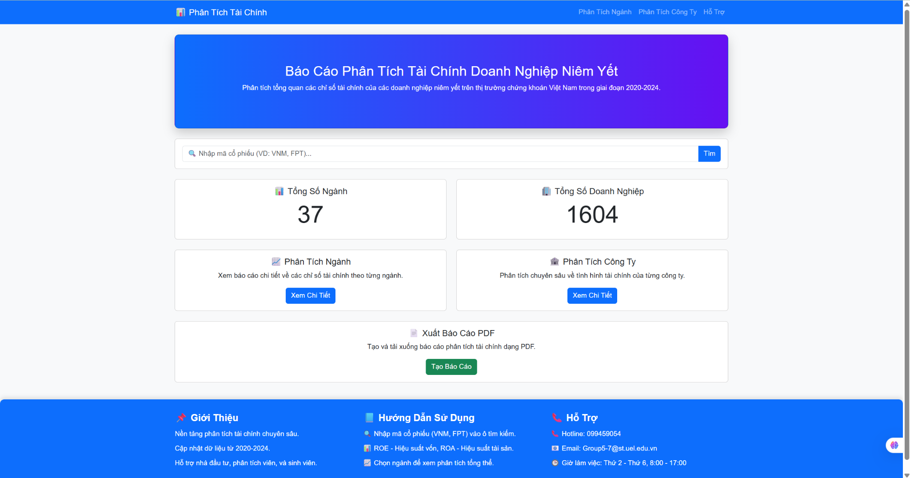
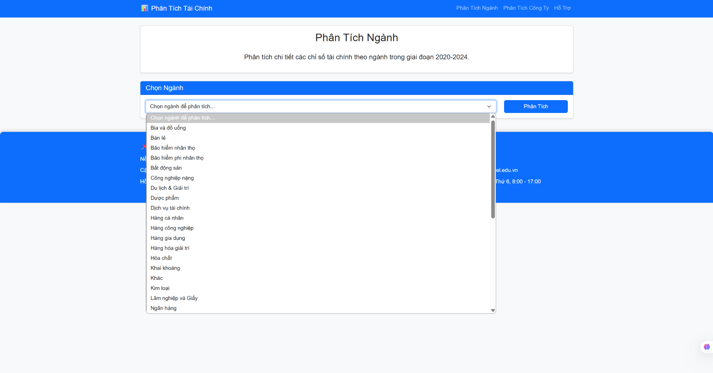
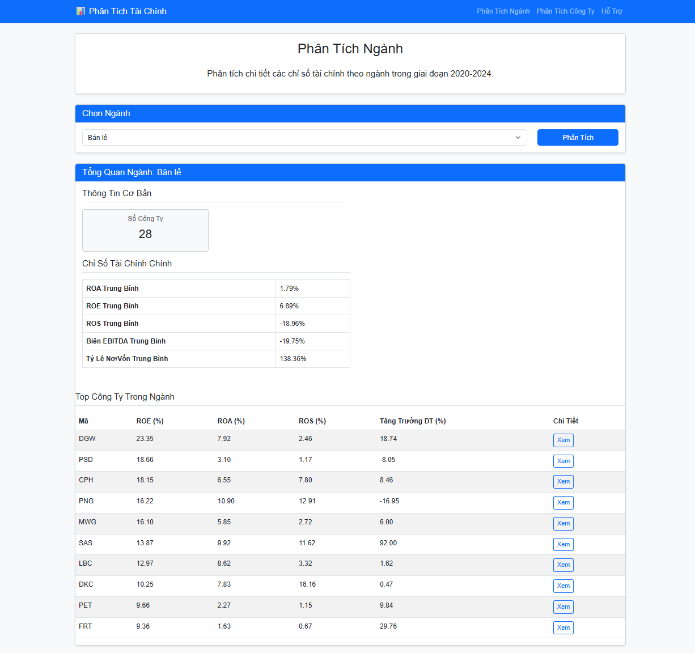
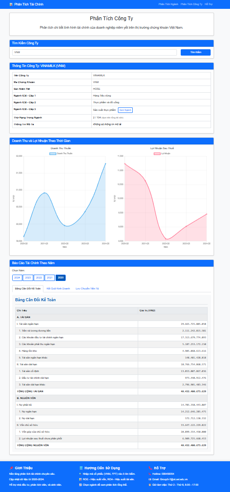
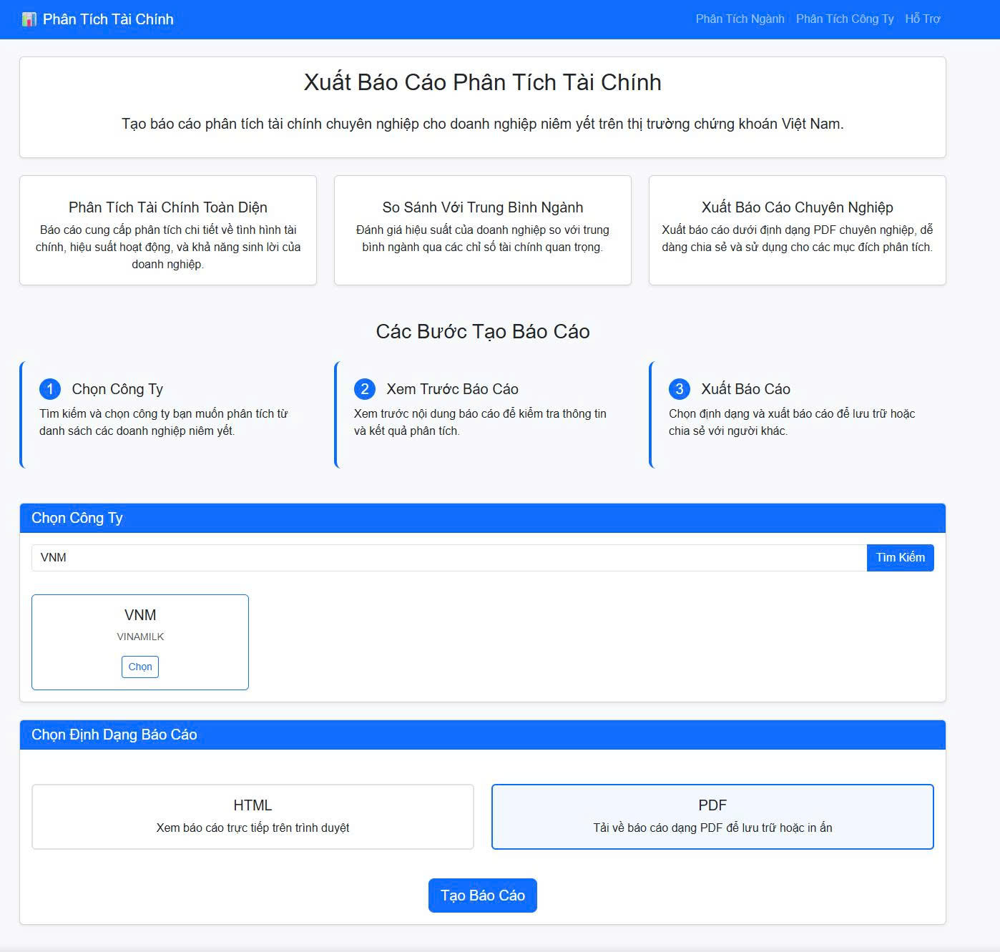

# 📊 Financial Analysis Report – Báo Cáo Phân Tích Tài Chính Doanh Nghiệp Niêm Yết

> **Nền tảng web tự động hóa phân tích tài chính chuyên sâu cho doanh nghiệp niêm yết tại Việt Nam (2020–2024).**  
> Giao diện trực quan, so sánh ngành, phân tích công ty, xuất báo cáo PDF chuyên nghiệp.

---


*Giao diện dashboard tổng quan*

---

## 🚀 Tính Năng Nổi Bật

- **Tổng quan thị trường**: Thống kê ngành & doanh nghiệp trên sàn VN.
- **Phân tích ngành**: Tự động tổng hợp ROE, ROA, ROS, tăng trưởng doanh thu, đòn bẩy, hiệu quả hoạt động theo ngành.
- **Phân tích chi tiết công ty**: Dashboard biểu đồ động (doanh thu, lợi nhuận, BCTC nhiều năm), chỉ số tài chính từng năm.
- **So sánh ngành/công ty**: Đặt chỉ số của từng doanh nghiệp cạnh trung bình ngành (nhấn mạnh điểm mạnh/yếu vượt trội).
- **Xuất báo cáo PDF**: Tạo báo cáo tài chính chuyên nghiệp (xem [ví dụ báo cáo VNM](./Bao_Cao_VNM.pdf)).
- **Hỗ trợ người dùng**: Hướng dẫn sử dụng, hỗ trợ sinh viên & nhà đầu tư.

---

## 🎬 Demo Giao Diện

| Dashboard Chính                                                    | Chọn Ngành & So Sánh                                       | Phân Tích Ngành                    |
|--------------------------------------------------------------------|------------------------------------------------------------|-------------------------------------|
|            |    |  |

| Phân Tích Công Ty                                                  | Xuất Báo Cáo PDF                                           |
|--------------------------------------------------------------------|------------------------------------------------------------|
|            |    |


---

## 📥 Cài Đặt & Chạy Ứng Dụng

### 1. Clone & tạo môi trường

```bash
git clone [https://github.com/](https://github.com/)<your-username>/<repo-name>.git
cd <repo-name>
python -m venv venv
source venv/bin/activate  # hoặc venv\Scripts\activate với Windows
pip install -r requirements.txt
````

### 2\. Chạy ứng dụng

```bash
python app.py
```

  - Sau đó mở trình duyệt truy cập: http://localhost:5000

-----

## 📂 Cấu Trúc Thư Mục

```css
├── app.py            # Main Flask App
├── config.py         # Cấu hình ứng dụng
├── static/img/       # Ảnh giao diện, screenshot, icon
├── templates/        # HTML Templates
├── data/             # File dữ liệu tài chính (CSV, Excel)
├── utils/            # Xử lý số liệu, tiền xử lý
├── requirements.txt  # Thư viện cần thiết
└── README.md         # Tệp tin này
```

-----

## 📖 Hướng Dẫn Sử Dụng

  - **Tìm mã cổ phiếu** (VNM, FPT, ...) để xem dashboard công ty.
  - **Chọn ngành** để xem tổng hợp và so sánh chỉ số ngành.
  - **Nhấn “Tạo báo cáo”** để xuất PDF tài chính chuyên nghiệp cho công ty.
  - **Sử dụng tính năng so sánh** để biết công ty mạnh/yếu hơn ngành ở đâu.
  - **Xem file mẫu PDF**: [Bao\_Cao\_VNM.pdf](./Bao_Cao_VNM.pdf)

-----

## 📄 Ví Dụ Báo Cáo PDF Tự Động

Dưới đây là trích đoạn từ báo cáo mẫu xuất PDF cho công ty VINAMILK (VNM):

```less
BÁO CÁO PHÂN TÍCH TÀI CHÍNH - VINAMILK

1. So sánh chỉ số tài chính với trung bình ngành:
- ROA: 19.02% (cao hơn ngành 22.08%)
- ROE: 28.21% (cao hơn ngành 0.46%)
- ROS: 16.17% (cao hơn ngành 35.10%)
- Tăng trưởng doanh thu: 0.90% (thấp hơn ngành 11.04%)
- Thanh khoản hiện hành: 2.08 (thấp hơn ngành 0.70)
...

2. Đánh giá tổng thể:
- Khả năng sinh lời: Xuất sắc
- Cơ cấu vốn: An toàn, tỷ lệ nợ thấp
- Hiệu quả hoạt động: Ở mức hợp lý
- Khuyến nghị: Duy trì ổn định, tối ưu hóa chi phí, tập trung thị trường lợi nhuận cao

(Xem báo cáo PDF đầy đủ tại [Bao_Cao_VNM.pdf](./Bao_Cao_VNM.pdf))
```

-----

## 👋 Đóng Góp & Phát Triển

  - Mọi ý kiến đóng góp, issue, hoặc pull request đều được hoan nghênh.
  - Repo phù hợp sinh viên, nhà đầu tư, chuyên viên tài chính muốn tự động hóa báo cáo & dashboard doanh nghiệp.

-----

## 📝 Giấy Phép

Distributed under the MIT License.

-----

*Made with ❤️ by Group 5 - UEL FinTech | Contact: Group5-7@st.uel.edu.vn*

```
```
